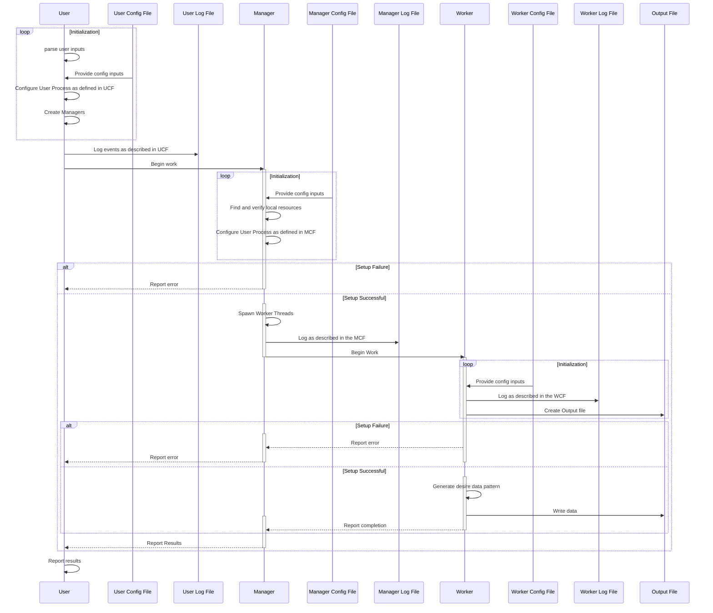

# Basic Overview
wordGen is design to allow for massively parallel, single-core, or a hybrid generation of pseudo-random data for use in large data sets.  The system uses a 30tier approach to tasking:
 - A User process to initialize resources and respond/report to a user
 - A Manager process to manage specific sets of workers
 - A Worker class to generate data

Workers operate as tasks (Threads) beneath the Manager (Processes), which responds to User (Process) once complete.

The separation of User and Managers allows wordGen to be distributed across a network/grid, not simply multiple cores, if desired.

### Basic Concepts
The table below summarizes the basic components of wordGen and their owners:

| Item | Type | Owner | Function |
| --- | --- | --- | -- |
| User | Python Process | N/A | Spawn all mangers, report progress, and respond to user input, if any. |
| Manager | Python Process | User (indirectly) | Spawns Worker tasks, manages their progress, and reports to Main. |
| Worker | Python Thread | Manager | Performs the work of generating the specified data as defined in the worker's JSON file. |
| Config File | JSON | User, Manager, or Worker | Defines various configuration parameters for the different script components, such as the type of work to perform or how many Threads per Process. |
| Log File | Text File | User, Manager, or Worker | Stores various log information about the respective worker/task, as defined by the levels in the Config File.  It defaults to the path defined in the Config File. |

## Basic Workflow

WordGen's basic workflow (Sequence Diagram) is illustrated below:

